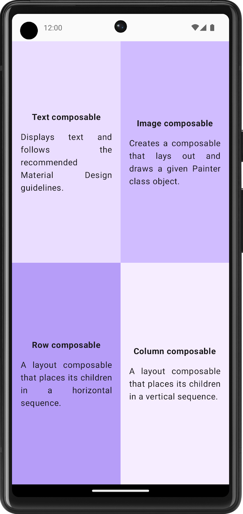

## Paso 1: Crea una nueva rama, implementa los cuadrantes y abre un Pull Request

_Ahora vamos a dividir la pantalla en cuatro cuadrantes y mostrar la información._

En este paso, primero crearás una nueva rama para trabajar en tu solución, luego aplicarás lo aprendido sobre Compose para estructurar la interfaz de la app y practicarás el flujo de trabajo con Pull Requests en GitHub.

---

### :keyboard: Actividad: Crea una rama, implementa la UI y abre un Pull Request

1. Crea una nueva rama llamada `quadrant-app` desde la rama `main`.
2. Modifica el archivo principal de tu app para dividir la pantalla en cuatro partes iguales usando `Row` y `Column` de Compose.
3. En cada cuadrante, muestra el nombre de una función Composable y una breve descripción.
4. Haz commit de tus cambios con el mensaje:  
   `Implement quadrant UI`
5. Abre un Pull Request hacia la rama `main` con el título:  
   `Quadrant app implementation`  
   y una breve descripción de lo que hiciste.

#### Screenshot final

---

¿Tienes problemas?
 

- Verifica que tu Pull Request tenga el título y la descripción correctos.
- Asegúrate de que tu commit tenga el mensaje sugerido.
- Si tienes dudas sobre cómo usar `Row` y `Column`, revisa la documentación enlazada en el README.
- Si no sabes cómo crear una rama, puedes hacerlo desde la pestaña "Code" en GitHub o usando el comando `git checkout -b quadrant-app` en tu terminal.